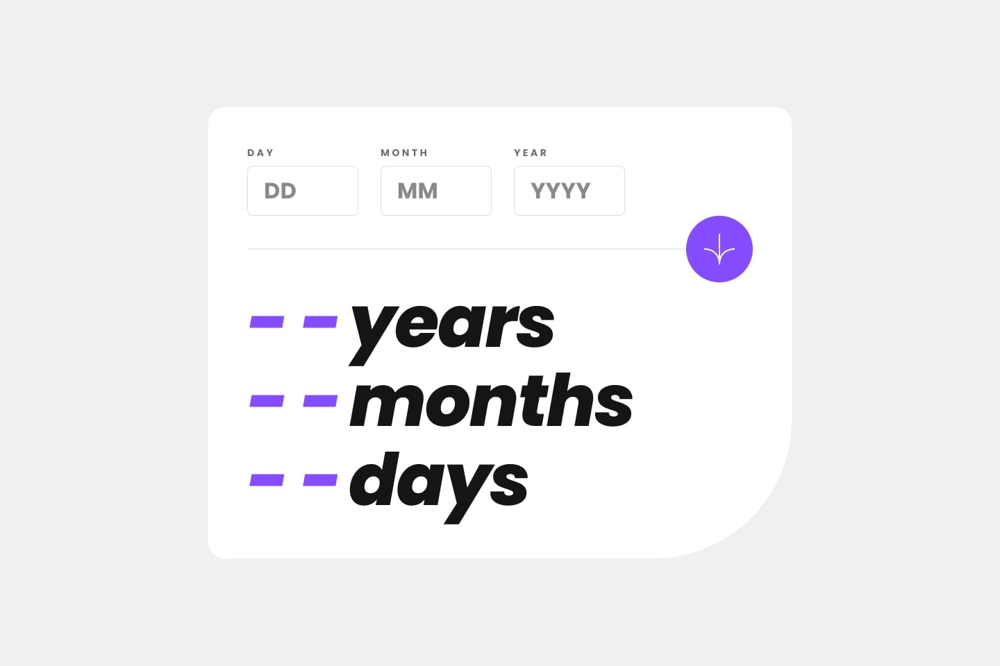

# Frontend Mentor - Age calculator app

## Welcome! 👋

This repository contains the Frontend Mentor challenge of the application to calculate the age.

It is being built on React , Vite , TypeScript & Vitest

[Frontend Mentor](https://www.frontendmentor.io) challenges help you improve your coding skills by building realistic projects.

**Thanks for watching.** 🤓
